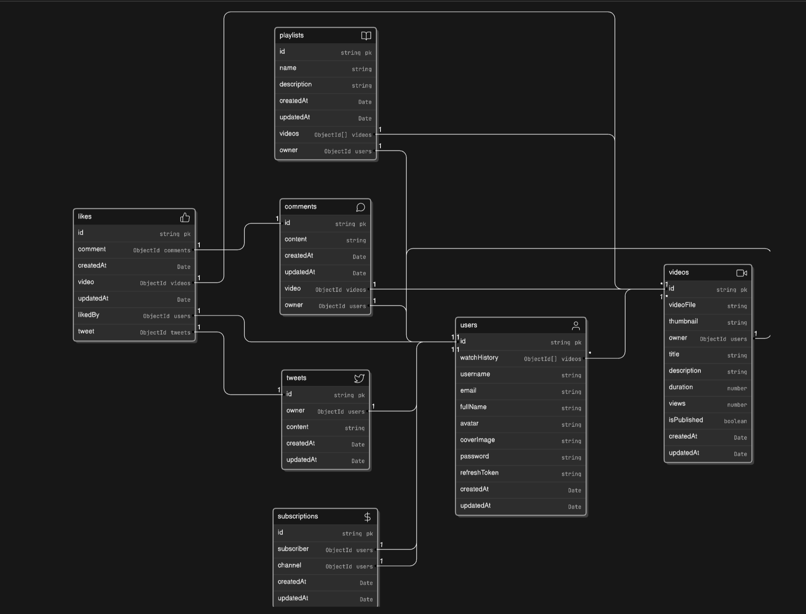

# BackEnd Project

## Table of Contents
- [Overview](#overview)
- [Features](#features)
- [Installation](#installation)
- [Usage](#usage)
- [Utilities](#utilities)
- [Note](#note)

## Overview
This project is a backend template for a video streaming platform. It includes functionalities for user management, video management, playlists, tweets, comments, likes, and subscriptions. It is built using Node.js, Express, and MongoDB.



[View Model Details](https://app.eraser.io/workspace/5YkJbZ1bUavMNLKys1k3?origin=share)

## Features
- User registration and authentication
- Video upload and management
- Playlist creation and management
- Tweet creation and management
- Commenting on videos
- Liking videos, comments, and tweets
- Subscribing to channels
- Dashboard for channel statistics
- Cloudinary integration for hosting photos and videos

## Installation
1. Clone the repository:
    ```sh
    git clone https://github.com/your-repo.git
    cd your-repo
    ```

2. Install dependencies:
    ```sh
    npm install
    ```

3. Start the server:
    ```sh
    npm start
    ```

## Usage
- The server will be running at `http://localhost:your_port`.
- Use Postman or any API client to interact with the endpoints.

## Utilities
- **ApiError**: `src/utils/ApiError.js`
- **ApiResponse**: `src/utils/ApiResponse.js`
- **asyncHandler**: `src/utils/asyncHandler.js`
- **Cloudinary**: `src/config/cloudinary.js`

## Note
You are free to use this project as you like as well as make changes to it.